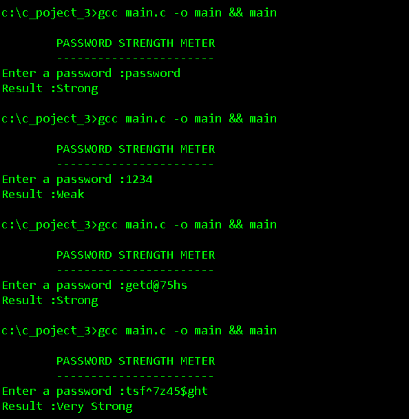

# PASSWORD STRENGTH METER

A basic CLI-based password strenght meter which gives the strength rating based on various basic password strength criterion.
Built to strengthen core programming concepts — loops, conditions, and logic — without any shortcuts or premature complexity.

#### (NOTE : The logic based on which this program works is not completely related to actual password strength testers, but it incorporates basic tests for determining the strength of the password, which may or may not match practical results.)

### Features⚙️:
- Logical-based
- Pure C- programming
- Basic practical features
- User-friendly
--------

##  Tech Stack🚀🚀

- C programming language 
- Console-based UI
- logic-building
--------

### Concepts practiced🪛:
- conditional statements
- interation using loops(while,for)
- indentation
--------

### Future upgrades🛰️:
- Improve range and complexity logic of password testing
- Add practical criteria 
- Link to real-time password strength trends
- Feedback system for improvement
--------

### How to Run🔛 ?
Compile the file using any C compiler:

bash(command line)
### *Compile the file using any C compiler:
*gcc main.c -o main && main*   (for vs code)

--------------
### Sample output:

## Note:*For clear screen in the output,append the code with*

## *system("cls");*
//for WINDOWS OS

## *system("clear");*
//for MAC/LINUX OS 

--------------
### NOTE :
**If you find this repository insightful for your workflow ,consider dropping a *star⭐* or hitting fork.Open for feedbacks and knowledge exchange.**

### author 
*tecnolgd*
